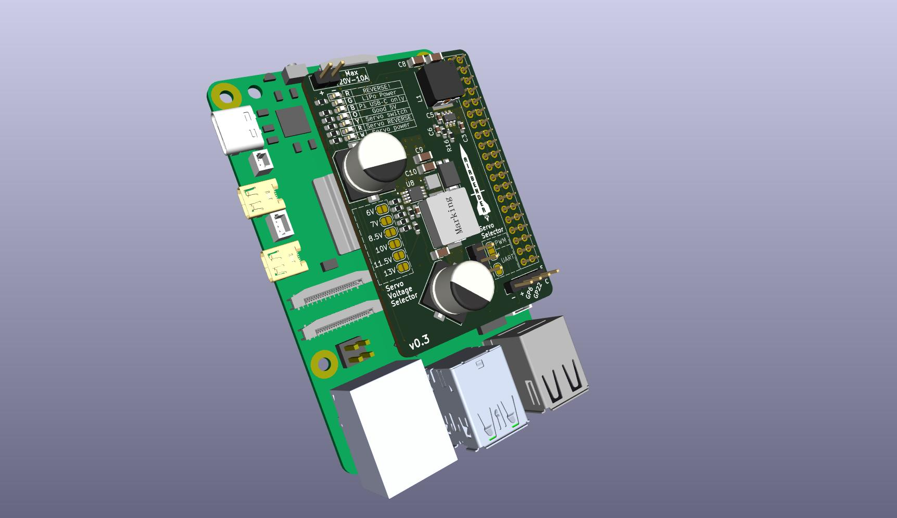
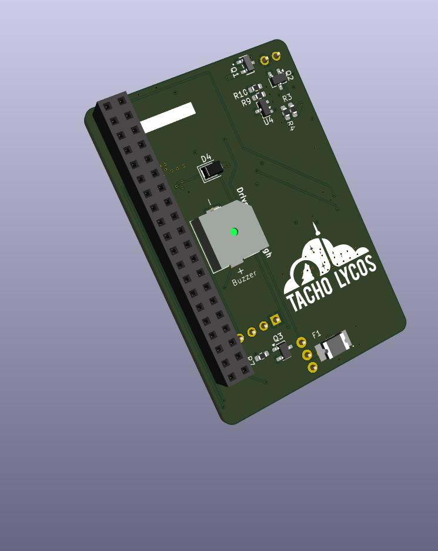

# airbrakes-pi-hat

Custom made Pi hat, named "Airbender", for use in Airbrakes

This repository contains the KiCad project files for a Raspberry Pi hat. This Pi hat is meant to control
airbrakes (see the [airbrakes repository](https://github.com/NCSU-High-Powered-Rocketry-Club/AirbrakesV2) for more details on the airbrakes system).

[](pcb-hat/pictures/airbender_front.jpg)
[](pcb-hat/pictures/airbender_back.jpg)


## Features

- Supports from 7V to 18V input voltage
- Variable output voltage for the servo power rail (7V to 14V), while simultaneously powering the Pi at 5V
- Current and voltage sensing for both the servo power rail and overall input power rail
- Reverse polarity protection on the input power rail
- LEDs for power and status indication
- Solder jumper pad to select using a servo via PWM or communicate with the servo via UART
- MOSFET to disable power to the servo rail when not in use
- Software controlled buzzer for audible alerts
- Resettable fuse to protect against long servo stalls

The repository includes schematic symbols, PCB footprints, 3D models, and all board files necessary to review, edit and manufacture the module.

---

## Quick Start — open the project

1. Install KiCad (see [Install and Setup](#install-and-setup) below).
2. Clone the repository:
```bash
git clone https://github.com/NCSU-High-Powered-Rocketry-Club/airbrakes-pi-hat.git && cd airbrakes-pi-hat
```

---

## Install and Setup

First, install KiCad from [kicad.org](https://kicad.org/download/). We recommend using the latest stable release of KiCad for new designs.

### After installation
- Open the `pcb-hat.kicad_pro` project. KiCad will use the `sym-lib-table` and `fp-lib-table` files included here if you open the board/schematic from this checkout.
- If KiCad shows missing library warnings, update the Project Library Tables or use the library manager to add the project's `sym-lib-table` and `fp-lib-table`.

---

## Repository structure

Root-level description (key files/folders):

- `milled/` — folder containing CNC milling files for in-house fabrication at the ECE Makerspace
- `pcb-hat/` — folder which contains the project files for the SMD version of the Pi hat
- `pcb-hat.kicad_sch` — schematic
- `pcb-hat.kicad_pcb` — PCB layout
- `pcb-hat.kicad_pro` — KiCad project file that links schematics, board and library tables
- `sym-lib-table` — project symbol library table that makes project-local symbols available to Eeschema
- `fp-lib-table` — project footprint library table that makes project-local footprints available
- `3dmodels/` — 3D STEP/WRL models used with footprints
- `symbols/` — human-editable symbol libraries (e.g., `connectors.kicad_sym`, `sensors.kicad_sym`)
- `footprints/` — footprint libraries as `.pretty` directories

---

## Library handling

We keep the project-specific libraries inside the repository so that board designs are reproducible and self-contained.

### Symbols
- New symbols are added to the project's `symbols` directory and are registered in the project's `sym-lib-table`.

### Footprints
- Footprints live inside `.pretty` folders in `footprints/`. Add footprints via the footprint editor and store them in an appropriate `footprints/<libname>.pretty` folder.

### 3D models
- 3D models are stored in `3dmodels/` and referenced by footprint model paths. Keep STEP files with good orientation and scale (KiCad's default is mm). We typically download the .step file from the manufacturer's website.
- If you add a footprint that references a 3D model, commit both the footprint in `footprints/` and the 3D model to `3dmodels/`.

---

## Good Practices & Design Rules

- Keep schematic symbols generic and footprints specific: do not hardcode assembly-side changes into symbols.
- Look at the existing schematic to see how we do things and try to be consistent.
- Save new libraries to the project-local tables (not global) to keep designs reproducible.
- Keep PCB footprints accurate — use accurate courtyard, 3D models, and update packaging information.
- Validate with DRC (PCB Editor > Inspect > Design Rules Checker) and ERC (Eeschema > Tools > ERC) before committing changes.
- When collaborating, include notes about part sources (Mouser/Digikey vendor links), footprints used, and any custom pad or thickness changes.

---

## Release & Manufacturing Checklist

Before requesting fab or assembling a board, run this checklist:
1. Run ERC (Eeschema > Tools > ERC) and fix all warnings.
2. Run DRC in PCB Editor and resolve all errors.
3. Create a BOM and confirm manufacturer part numbers and footprints match.
4. Get the [Fabrication Toolkit](https://github.com/bennymeg/Fabrication-Toolkit) plugin from the KiCad plugin repo
5. Click the generate gerber files button in the PCB editor (via the plugin). Keep all default options. Then export it. 
6. Check 3D model alignment in PCB Editor (View > 3D Viewer) to ensure components fit.
7. Tag or branch the repo in Git to preserve the release snapshot.

---

## License

See `LICENSE` at the repo root for licensing details.

---